# Flutter Car Locator

Find your car with ease using AR technology, Google Maps, and local discovery features. This professional Flutter application helps users locate their parked vehicles and discover nearby attractions.

## 📸 Screenshots

<p align="center">
  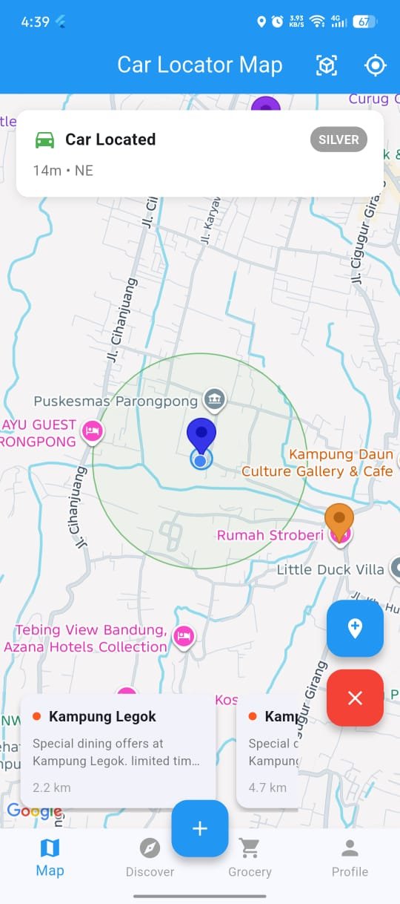
  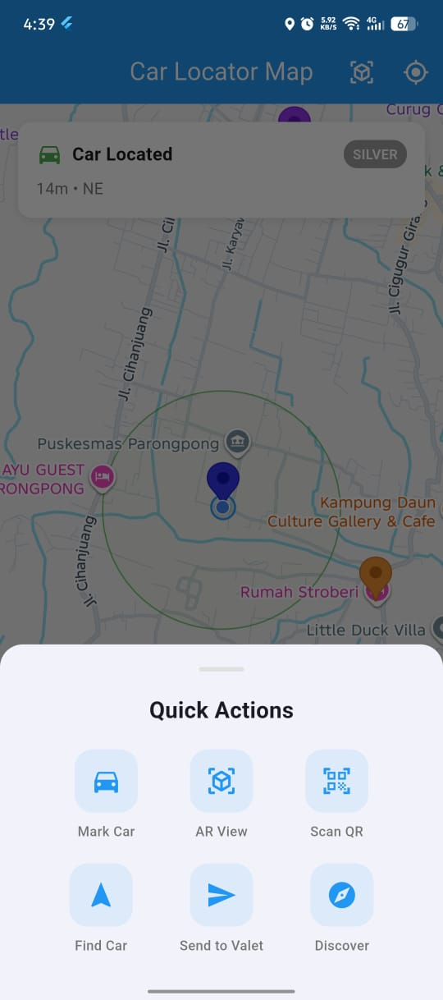
  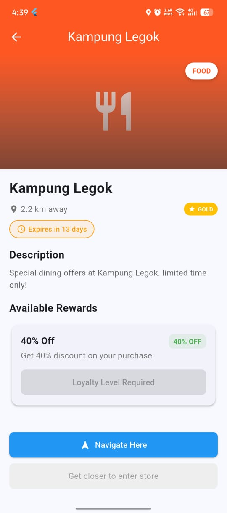
  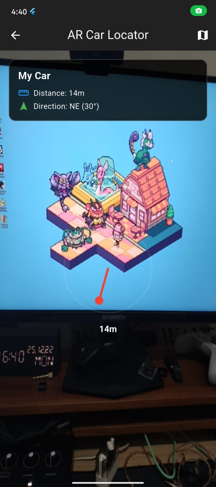
  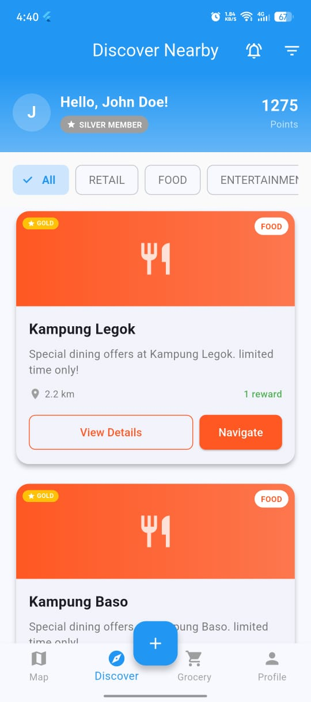
  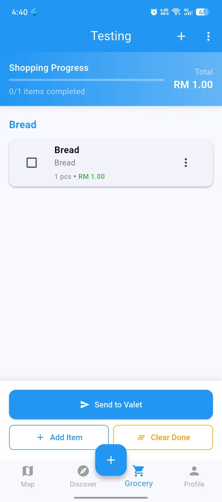
  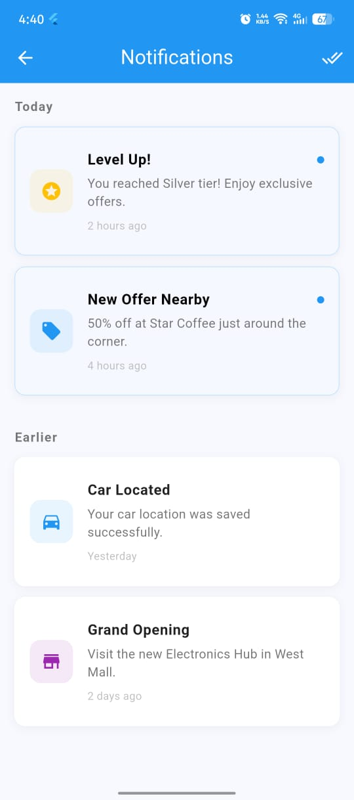
  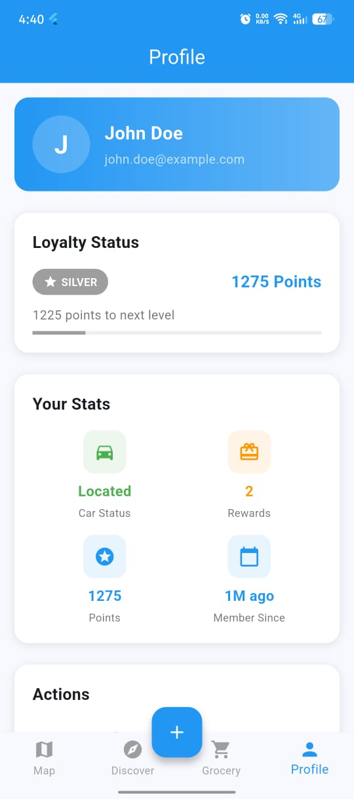
  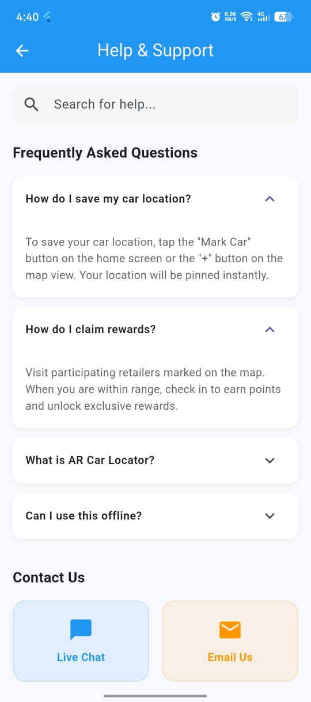
  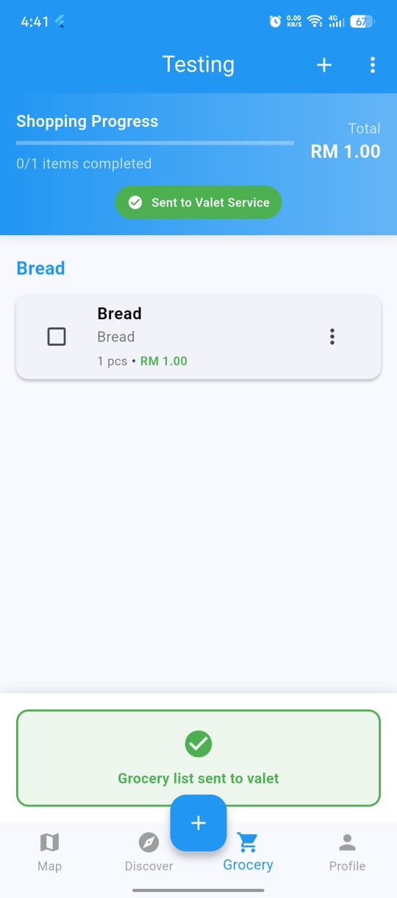
  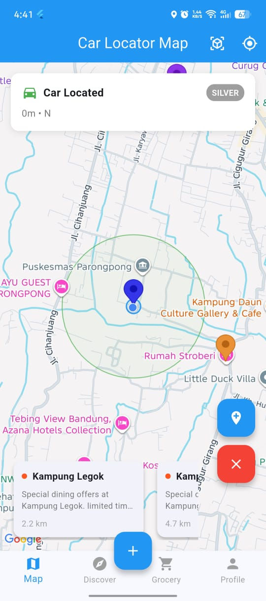
  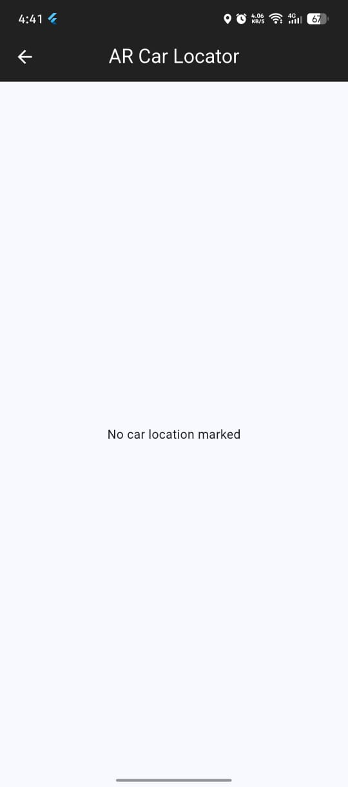
  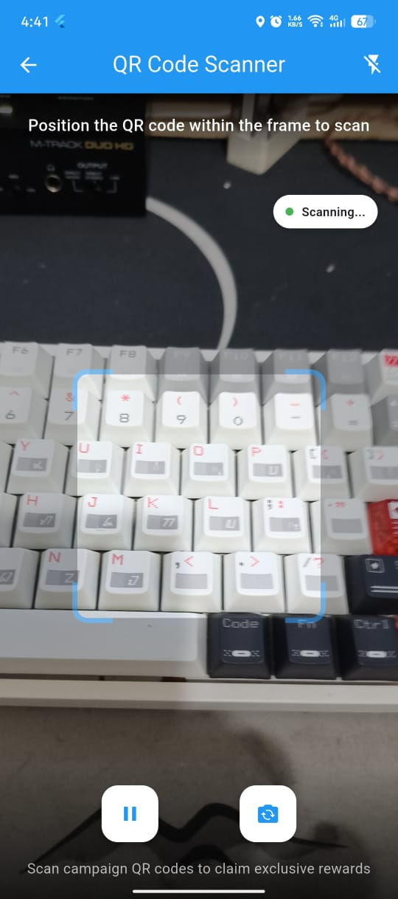
  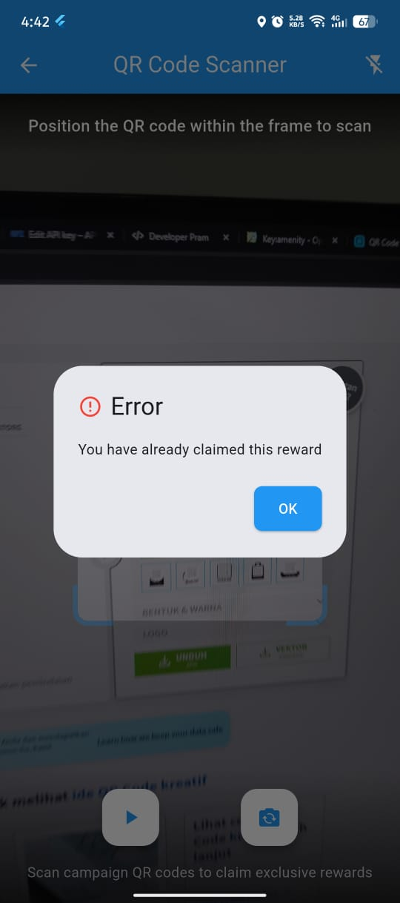
  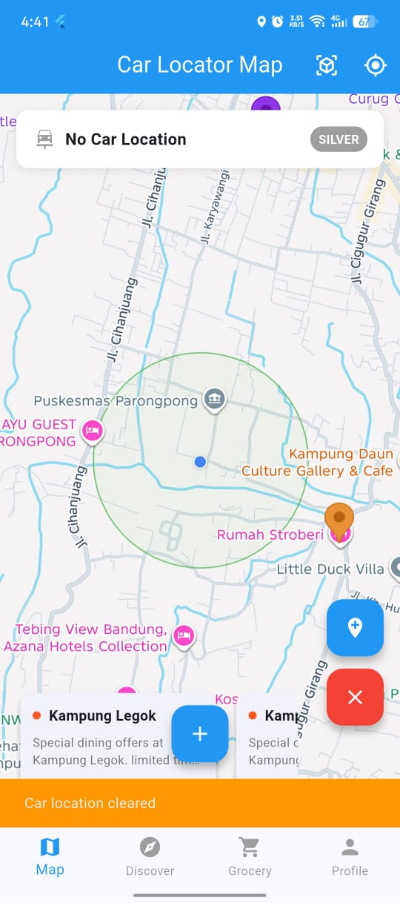
  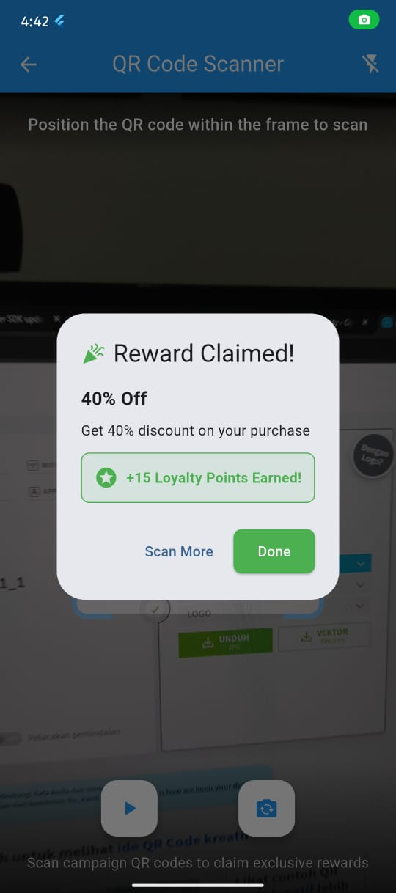
  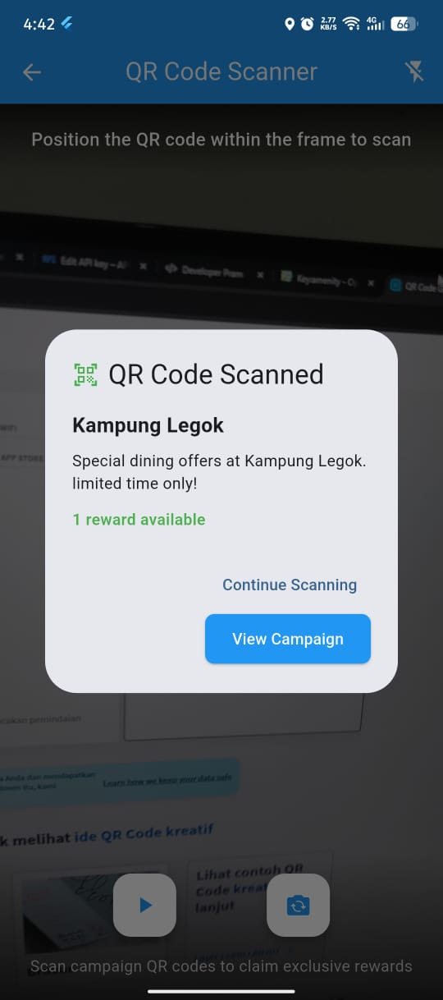
  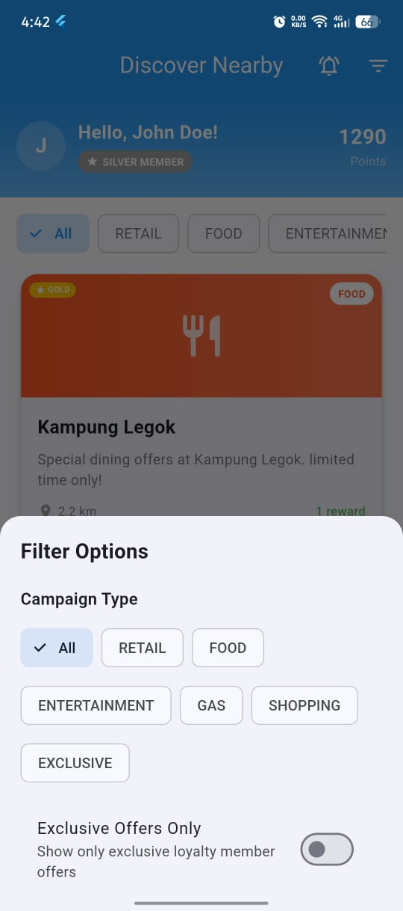
  
  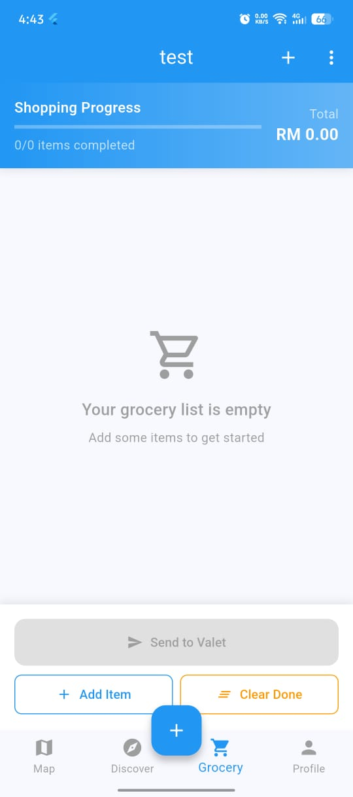
  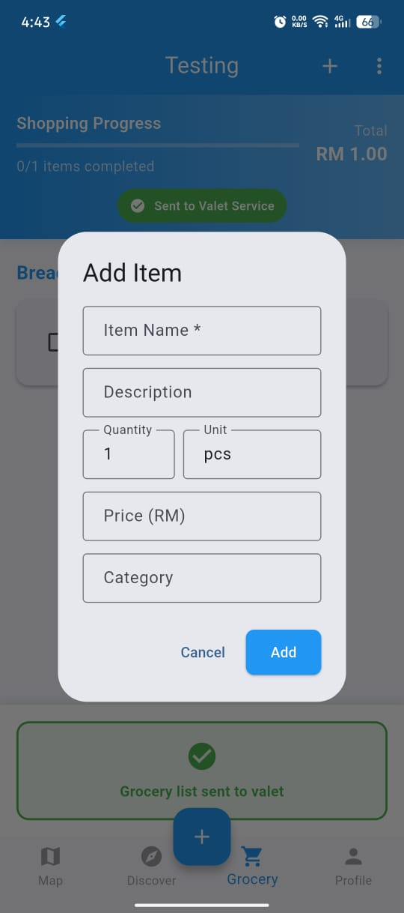
  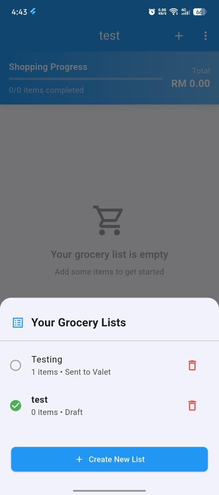
  
</p>

## 🚀 Key Features

- **📍 AR Car Locator**: Use Augmented Reality to find your parked car visually.
- **🗺️ Interactive Map**: Google Maps integration for real-time location tracking and car anchoring.
- **🔍 Retail Discovery**: Find nearby shops, cafes, and amenities using OpenStreetMap (Overpass API).
- **🛒 Grocery & Loyalty**: Manage grocery lists and track loyalty points with local store campaigns.
- **📱 QR Scanner**: Built-in QR scanner for quick interactions.
- **🔔 Smart Notifications**: Simulation of proximity and offer expiry alerts.

## 🛠️ Technology Stack

- **Framework**: [Flutter](https://flutter.dev) (SDK ^3.8.1)
- **Language**: [Dart](https://dart.dev)
- **State Management**: [Riverpod](https://riverpod.dev) with [Riverpod Generator](https://pub.dev/packages/riverpod_generator)
- **Maps**: [Google Maps Flutter](https://pub.dev/packages/google_maps_flutter)
- **Places Data**: [OpenStreetMap (Overpass API)](https://wiki.openstreetmap.org/wiki/Overpass_API)
- **Animations**: [Flutter Animate](https://pub.dev/packages/flutter_animate) & [Lottie](https://pub.dev/packages/lottie)
- **Storage**: [Hive](https://pub.dev/packages/hive) & [Shared Preferences](https://pub.dev/packages/shared_preferences)

## 📋 Getting Started

### Prerequisites

- Flutter SDK: `^3.8.1`
- Dart SDK: `^3.8.1`
- A Google Cloud Project with Maps SDK for Android/iOS enabled.

### API Configuration

#### 1. Google Maps API Key
You need a Google Maps API key to use the map features. 
- Follow the official [Google Maps Flutter guide](https://pub.dev/packages/google_maps_flutter#getting-started) to set up your keys.
- **Android**: Add your key in `android/app/src/main/AndroidManifest.xml`.
- **iOS**: Add your key in `ios/Runner/AppDelegate.swift`.

#### 2. OpenStreetMap API
The app uses the **Overpass API** via `PlacesService` to fetch nearby places. This is a free, public API and does not require a dedicated API key for standard usage. The app automatically cycles through several Overpass mirror servers for reliability.

### Installation

1. Clone the repository:
   ```bash
   git clone https://github.com/KaptenDia/flutter_car_locator.git
   ```
2. Install dependencies:
   ```bash
   flutter pub get
   ```
3. Run code generation (required for Riverpod):
   ```bash
   flutter pub run build_runner build --delete-conflicting-outputs
   ```
4. Run the app:
   ```bash
   flutter run
   ```

## 🏗️ Project Structure

The project follows a feature-first architecture:

```text
lib/
├── core/               # Shared logic, services, and constants
│   ├── constants/      # App-wide strings, colors, constants
│   ├── models/         # Data models
│   ├── providers/      # Riverpod providers/notifiers (global state)
│   └── services/       # External service integrations (Maps, Storage, Notifications)
├── features/           # UI and logic separated by feature
│   ├── ar_locator/     # AR-based car finding
│   ├── grocery/        # Grocery list management
│   ├── home/           # Dashboard / Navigation
│   ├── map/            # Google Maps main view
│   ├── profile/        # User profile and settings
│   ├── qr_scanner/     # QR scanning functionality
│   └── retail_discovery/ # Nearby places & retail rewards
├── shared/             # Common widgets used across features
└── main.dart           # App entry point
```

## 🌟 Bonus Work & Advanced Features

- **📋 Valet Grocery Integration**: A pre-filled grocery list interface featuring a dedicated **"Send to Valet"** button, bridging the gap between retail discovery and vehicle services.
- **🛡️ Smart QR Validation**: The QR scanner includes advanced logic to validate campaign and reward codes, preventing duplicate claims and ensuring users meet loyalty requirements before unlocking rewards.
- **⚡ Proximity & Offer Simulations**: Real-time simulation of push notifications for **"Offer expires soon!"** alerts, demonstrating how the app handles time-sensitive retail engagements.
- **💎 Premium Profile Experience**: An enhanced UI-only profile section featuring modular actions for **Notifications Management**, **App Settings**, and **Help & Support** centers.

## 🧠 State Management Approach

This project uses **Riverpod** for state management, leveraging **code generation** for better developer experience and type safety.

- **Providers**: Located in `lib/core/providers/`.
- **Notifiers**: We use `AsyncNotifier` and `Notifier` patterns to handle state updates.
- **Auto-generation**: Run `build_runner` to generate the `.g.dart` files whenever you modify providers.
